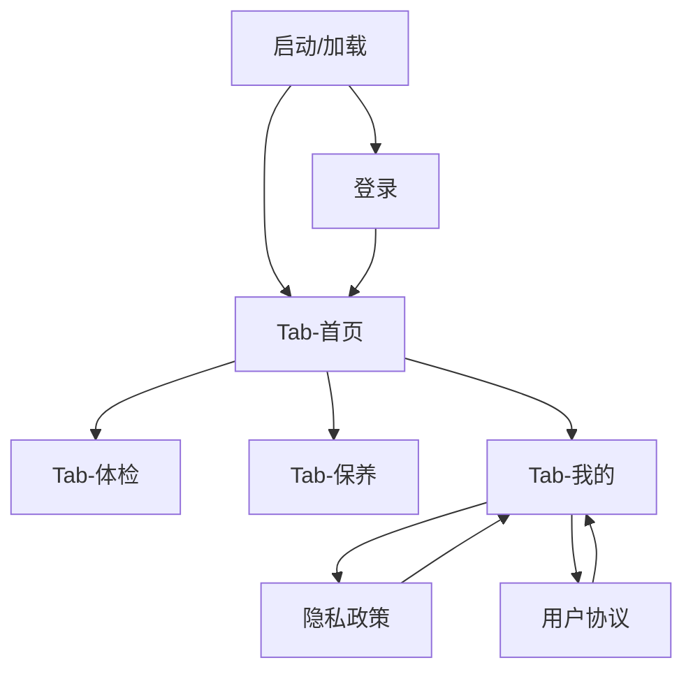

## 1. 产品概述
面向车主端微信小程序（`clients/mp_customer_uni` 为长期方案，`clients/mp_customer` 为现有 H5 骨架）的专项优化需求。
以“性能、体验、可维护性”为核心，保证既有业务流程与页面不变。

## 2. 核心功能

### 2.1 用户角色
| 角色 | 使用/接入方式 | 核心权限 |
|------|----------------|----------|
| 车主用户 | 微信小程序进入，登录后使用 | 浏览车辆与首页数据；查看体检/保养/推荐/科普；查看我的；访问隐私/协议 |
| 研发/测试/运维 | 内部协作 | 通过可观测性、规范与自动化提升交付与回归效率（不新增后台页面） |

### 2.2 功能模块
本次优化需求由以下页面/模块构成（不新增业务页面，仅增强质量属性）：
1. **全局基础能力**：启动与首屏、路由与登录态、网络层、错误/空态/加载态、埋点与日志（如 trace_id）、配置与环境隔离。
2. **登录**：弱网/失败提示一致性、登录态恢复速度、避免重复登录与跳转抖动。
3. **首页（Tab：首页/体检/保养/我的）**：列表与卡片渲染性能、请求并发与缓存策略、切换 Tab 的响应速度。
4. **推荐 / 科普（非 Tab 页面）**：首屏资源最小化、懒加载与分页/增量加载（如有）。
5. **隐私政策 / 用户协议**：独立打包与秒开体验（可接受离线缓存）。

### 2.3 页面详情
| Page Name | Module Name | Feature description |
|---|---|---|
| 全局基础能力 | 启动与首屏 | 缩短冷启动白屏时间；降低首屏资源与同步阻塞；保障页面切换不卡顿 |
| 全局基础能力 | 网络与稳定性 | 统一超时/重试/错误归一化；减少重复请求；支持必要的缓存与请求去重 |
| 全局基础能力 | 登录态与安全 | 401/失效时统一清理并引导重新登录；避免频繁读写本地存储造成卡顿 |
| 全局基础能力 | 可维护性基线 | 统一 API 封装与目录规范；减少页面内“散落请求/散落状态”；完善开发/测试约束 |
| 登录 | 交互与反馈 | 展示明确的加载态与失败原因；避免重复点击触发多次登录请求 |
| 首页（Tab） | 数据获取与缓存 | 优先展示缓存骨架/最近数据；后台刷新；失败时不阻断基础浏览 |
| 体检（Tab） | 渲染与列表性能 | 控制一次渲染数据量；优化长列表与组件层级；空态/错误态一致 |
| 保养（Tab） | 请求与状态 | 控制分页参数与重复请求；返回慢时展示可理解的加载与重试入口 |
| 推荐 / 科普 | 资源与路由 | 做到主包不被非核心页面拖大；进入即用、返回不重载 |
| 隐私政策 / 用户协议 | 打开体验 | 点击后快速展示；支持缓存；内容更新可控 |

## 3. 核心流程
- 车主进入小程序：完成启动加载 → 读取/恢复登录态 → 未登录则进入登录页。
- 登录成功：进入 Tab 首页 → 获取车辆列表与默认车辆 → 拉取首页数据；可在 Tab 间切换。
- 浏览功能：在“体检/保养”查看对应车辆数据；在“推荐/科普”查看内容；在“我的”查看个人相关信息。
- 合规访问：从“我的”进入隐私政策/用户协议并返回。
- 登录失效：任一接口返回 401 时，统一提示并跳转登录。

