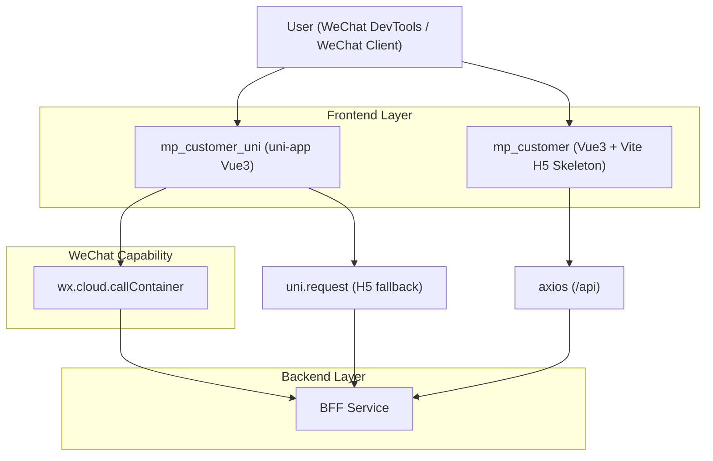

## 1.Architecture design

## 2.Technology Description
- Frontend (Mini Program, long-term): uni-app(Vue@3) + @dcloudio/vite-plugin-uni + sass + Vite@5
- Frontend (Legacy skeleton / fast iteration): Vue@3 + Vant@4 + Pinia@2 + Axios@1 + Vite@5
- Backend: Existing BFF service (REST), mini program calls `/mp/customer/*`

## 3.Route definitions
| Route | Purpose |
|---|---|
| pages/auth/login | 登录页（uni-app） |
| pages/dashboard/index | 首页 Tab（uni-app） |
| pages/health/index | 体检 Tab（uni-app） |
| pages/maintenance/index | 保养 Tab（uni-app） |
| pages/profile/index | 我的 Tab（uni-app） |
| pages/recommendations/index | 推荐（uni-app，非 Tab） |
| pages/knowledge/index | 科普（uni-app，非 Tab） |
| pages/privacy/index | 隐私政策（uni-app） |
| pages/agreement/index | 用户协议（uni-app） |

（H5 骨架路由：`/login`，以及 `/app/dashboard|health|maintenance|recommendations|knowledge|profile`）

## 4. 现状与问题清单（聚焦性能/体验/可维护性）

### 4.1 性能
- `mp_customer_uni`：网络层默认 `timeout=10000`，但缺少请求去重/缓存策略，页面易出现“反复拉同一份数据”。
- `mp_customer_uni`：云托管调用对 `TCB_BASE_PATH` 采用 404 兜底重试；若配置错误，可能造成每次请求“双发一次”直到命中 404 分支。
- `mp_customer`：`axios` 请求拦截器里每次请求都会 `auth.restoreSession()`，属于可避免的重复 IO/JSON parse。

### 4.2 体验
- `mp_customer_uni`：`request()` 内部直接 `uni.showToast()` + 抛异常，导致：
  - 业务层难以按页面场景定制提示（例如静默刷新 vs 用户触发）。
  - 可能出现“连续多 Toast”或遮挡关键操作。
- `mp_customer`：401 仅清 session 并 Toast，未统一路由重定向（可能出现“停留在受保护页面但数据加载失败”的困惑）。

### 4.3 可维护性
- `mp_customer_uni`：API 以字符串拼 URL（含 query string 拼接），易产生参数遗漏/编码问题，且难统一做缓存 key、签名、trace_id。
- `mp_customer_uni/src/config/env.js` 存在 `LOGIN_DEFAULTS`（测试手机号/车牌号），需要确保不会进入生产默认值。
- 两套客户端（uni / H5）在“错误归一化、trace_id、401 处理、token 刷新”等策略上存在差异，回归成本高。

## 5. 优化方案（按优先级落地）

### P0（1-3 天）：稳定性与体验底线
1) **网络层“副作用下沉”**
- 将 Toast/跳转从 `utils/request.js` 中抽离为可配置策略：网络层只返回结构化错误；页面决定“提示/静默/重试”。
- 统一错误码/错误文案映射（沿用现有 normalize 逻辑，但由上层决定是否展示）。

2) **401 与登录态统一处理**
- `mp_customer_uni`：保留现有 401 清 session + redirect，但避免重复触发（加互斥锁/一次性跳转）。
- `mp_customer`：在 401 时执行统一跳转到 `/login?redirect=...`（与 router guard 行为一致）。

3) **云托管 basePath 探测缓存**
- 若发生一次 404 回退（`${TCB_BASE_PATH}${url}` -> `url`），将探测结果缓存到内存（本次会话）并后续直接走正确 path，避免重复“双发”。

### P1（1-2 周）：性能与可维护性体系化
1) **请求去重 + 轻缓存（以“车辆列表/首页聚合接口”为先）**
- 对 `/mp/customer/vehicles`、`/mp/customer/home` 做 in-flight 去重（同一时刻同 key 只发一次）。
- 对“可接受短时陈旧”的数据做 TTL 缓存（如 30-120s），先渲染缓存再后台刷新。

2) **trace_id 对齐**
- `mp_customer` 已有 `X-Trace-Id`；`mp_customer_uni` 增加同等 header（无需引入依赖，可用时间戳+随机数组合），便于后端排障与端到端追踪。

3) **uni-app 分包（主包瘦身）**
- 将“隐私政策/用户协议/推荐/科普”等非 Tab 页面纳入 `subPackages`，降低主包体积与冷启动成本。

4) **API 组装规范化**
- 统一 query 参数组装（由对象转 query），避免手拼字符串；为后续类型化与自动化测试打基础。

### P2（持续）：工程质量与回归效率
- 渐进式 TypeScript 化（优先 api/request/session 与关键页面数据模型）。
- 用 OpenAPI/契约文件生成 API 客户端与类型（减少“接口改动->多端手改”）。
- 增加最小化 E2E 冒烟（登录->进入首页->切换 Tab->退出/401）与网络弱网场景回归脚本。

## 6. 验证与度量（建议作为验收口径）
- 性能：冷启动到首页可交互时间、Tab 切换响应时间、主要接口 95 分位耗时、重复请求次数。
- 体验：401 后跳转一致性、错误提示命中率（有意义文案/非“请求失败”兜底）、多 Toast 频率。
- 可维护性：网络层/错误处理策略统一程度、API 拼接点数量下降、跨端差异项清单收敛。
